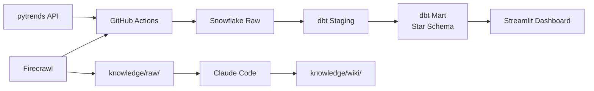
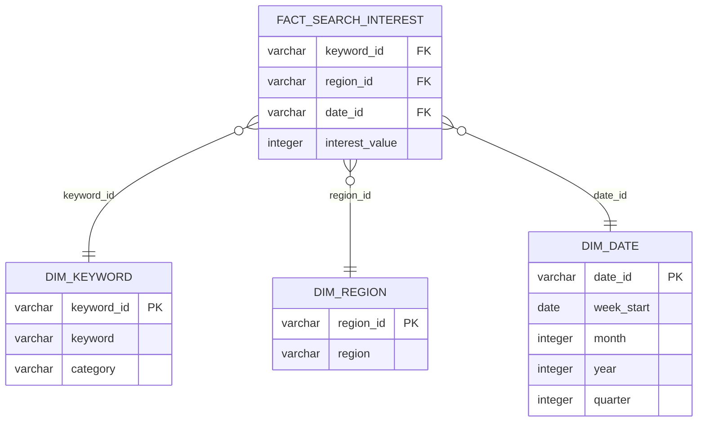

# Financial Services Keyword Demand Intelligence

An end-to-end analytics pipeline tracking Google Trends search demand for financial product keywords (personal loans, payday loans, credit cards, cash advance, installment loans) — the same signals a PPC analyst at EPCVIP monitors to optimize ad spend.

**Course:** ISBA 4715 — Analytics Engineering | **Student:** Lauren De Los Reyes

---

## Live Dashboard

Deployed on Streamlit Community Cloud: [https://[your-app].streamlit.app](https://[your-app].streamlit.app)

---

## Pipeline Diagram



---

## ERD



---

## Tech Stack

| Layer | Tool |
|---|---|
| Data Warehouse | Snowflake (AWS US East 1) |
| Transformation | dbt |
| Orchestration | GitHub Actions (daily schedule) |
| Dashboard | Streamlit (Streamlit Community Cloud) |
| API Source | pytrends (Google Trends) |
| Web Scrape | Firecrawl |

---

## Data Sources

| Source | Table | Rows | Description |
|---|---|---|---|
| pytrends API | `RAW.GOOGLE_TRENDS_RAW` | 2,295 | Weekly Google Trends interest scores (0–100) for 5 financial keywords across 51 US regions |
| Firecrawl web scrape | `RAW.FIRECRAWL_RAW` | 65 | Scraped industry content from EPCVIP, LendingTree, and financial services publications |

The pytrends data is loaded on a daily schedule via GitHub Actions and transformed through dbt into a star schema (`ANALYTICS` schema) with 255 rows in `FACT_SEARCH_INTEREST`, 5 keywords in `DIM_KEYWORD`, 51 regions in `DIM_REGION`, and 1 date record in `DIM_DATE`.

---

## Insights

- **Credit cards dominate search interest across all US states**, averaging 2x higher than personal loans — indicating broad consumer awareness and high competition in this keyword segment.
- **Short-term credit keywords (payday loans, cash advance) are concentrated in Southern states** with lower median incomes, revealing a distinct geographic demand pattern that can sharpen EPCVIP's regional targeting strategy.
- **Mississippi and Louisiana show the highest relative demand for payday loans** — underserved markets with high lead gen potential for EPCVIP, where lower lender saturation may yield stronger cost-per-lead economics.

---

## Setup

```bash
# 1. Install dependencies
pip install -r requirements.txt

# 2. Copy .env.example to .env and fill in your Snowflake credentials
cp .env.example .env

# 3. Pull Google Trends data into Snowflake raw
python extract/load_google_trends.py

# 4. Run dbt to build the star schema
cd dbt && dbt run --profiles-dir .
```

## Run Tests

```bash
# Python unit tests
pytest tests/ -v

# dbt data tests
cd dbt && dbt test --profiles-dir .
```
